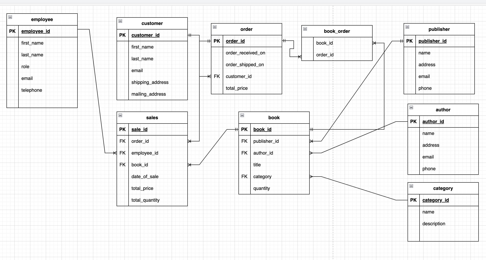
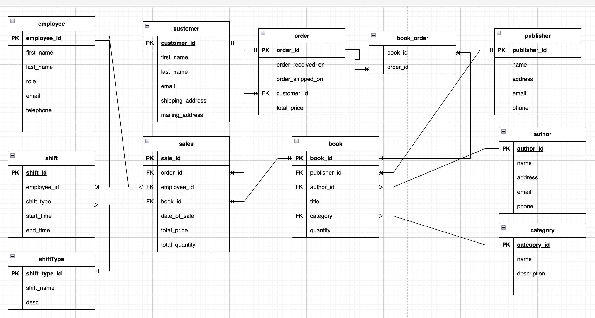

# Assignment 1: Design a Logical Model

## Question 1
Create a logical model for a small bookstore. 📚

At the minimum it should have employee, order, sales, customer, and book entities (tables). Determine sensible column and table design based on what you know about these concepts. Keep it simple, but work out sensible relationships to keep tables reasonably sized. Include a date table. There are several tools online you can use, I'd recommend [_Draw.io_](https://www.drawio.com/) or [_LucidChart_](https://www.lucidchart.com/pages/).


## Question 2
We want to create employee shifts, splitting up the day into morning and evening. Add this to the ERD.


## Question 3
The store wants to keep customer addresses. Propose two architectures for the CUSTOMER_ADDRESS table, one that will retain changes, and another that will overwrite. Which is type 1, which is type 2?

_Hint, search type 1 vs type 2 slowly changing dimensions._

Bonus: Are there privacy implications to this, why or why not?
```
<u>Type 1 SCDs - Overwriting</u>

In a Type 1 SCD the new data overwrites the existing data. Thus the existing data is lost as it is not stored anywhere else. This is the default type of dimension you create. You do not need to specify any additional information to create a Type 1 SCD.

<u>Type 2 SCDs - Creating another dimension record</u>

A Type 2 SCD retains the full history of values. When the value of a chosen attribute changes, the current record is closed. A new record is created with the changed data values and this new record becomes the current record. Each record contains the effective time and expiration time to identify the time period between which the record was active.

Store is intending to implement Type 2 approach. There are ofcourse various privacy implications to this for example -

1) Addresses are considered PII and Bookstore team should consider the prominent data protection and privacy laws and regulations based on the country/region they are going to store the customer information of.
2) Storing addresses in a database also involves implementing appropriate security measures to protect address data against unauthorized access and breaches. Data breaches can result in significant financial, reputational, and legal damages for the organization and the data subjects. They can also expose the organization to regulatory fines, penalties, civil lawsuits, and claims. They need to consider the security measures that can help prevent and mitigate data breaches for example - data encryption , data backups, data access controls, data rentention policies etc.

(https://www.geopostcodes.com/blog/best-practices-storing-addresses/)

```

## Question 4
Review the AdventureWorks Schema [here](https://i.stack.imgur.com/LMu4W.gif)

Highlight at least two differences between it and your ERD. Would you change anything in yours?
```
1. Complexity and Scope
   AdventureWorks schema is more complex with more entities, including detailed tables for functions like 'Production', 'Sales', 'HumanResources','Credit card' etc. The bookstore schema is small and simple, focusing on core entities like employees, orders, sales, customers, and books.

2. Normalization
    AdventureWorks schema is following the principals of  normalization with many relationships and reference tables. The bookstore schema is relatively straightforward, with fewer tables and relationships, focusing on essential business functions.
```

# Criteria

[Assignment Rubric](./assignment_rubric.md)

# Submission Information

🚨 **Please review our [Assignment Submission Guide](https://github.com/UofT-DSI/onboarding/blob/main/onboarding_documents/submissions.md)** 🚨 for detailed instructions on how to format, branch, and submit your work. Following these guidelines is crucial for your submissions to be evaluated correctly.

### Submission Parameters:
* Submission Due Date: `September 28, 2024`
* The branch name for your repo should be: `model-design`
* What to submit for this assignment:
    * This markdown (design_a_logical_model.md) should be populated.
    * Two Entity-Relationship Diagrams (preferably in a pdf, jpeg, png format).
* What the pull request link should look like for this assignment: `https://github.com/<your_github_username>/sql/pull/<pr_id>`
    * Open a private window in your browser. Copy and paste the link to your pull request into the address bar. Make sure you can see your pull request properly. This helps the technical facilitator and learning support staff review your submission easily.

Checklist:
- [ ] Create a branch called `model-design`.
- [ ] Ensure that the repository is public.
- [ ] Review [the PR description guidelines](https://github.com/UofT-DSI/onboarding/blob/main/onboarding_documents/submissions.md#guidelines-for-pull-request-descriptions) and adhere to them.
- [ ] Verify that the link is accessible in a private browser window.

If you encounter any difficulties or have questions, please don't hesitate to reach out to our team via our Slack at `#cohort-4-help`. Our Technical Facilitators and Learning Support staff are here to help you navigate any challenges.
